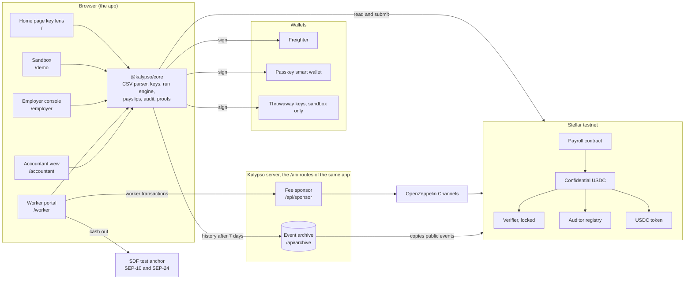
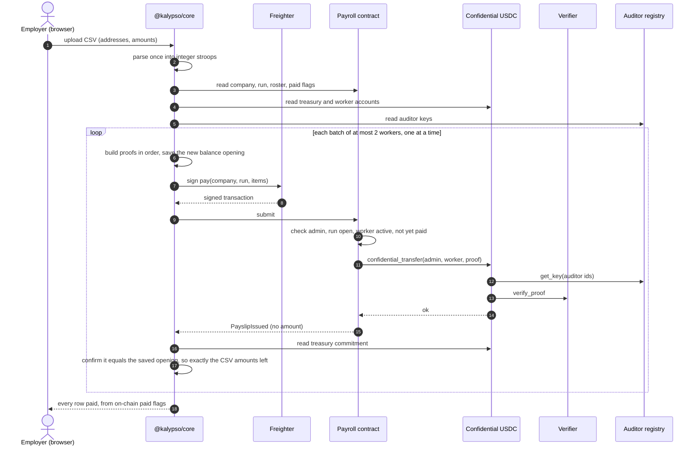
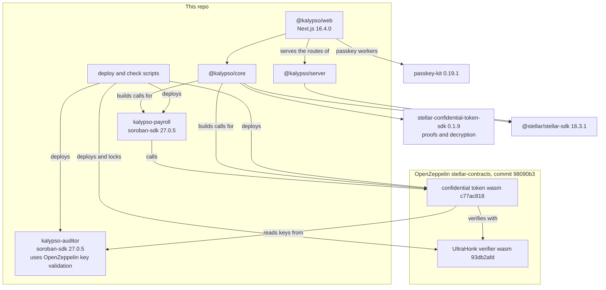

# Architecture

Kalypso pays a team in confidential USDC on Stellar. Amounts are hidden on the public ledger; each worker reads their own pay; the company's accountant reads everything the company paid. This page shows how the pieces fit, one payroll run end to end, and what depends on what.

Testnet stack (from `packages/contracts/deployments/testnet.json`; the payroll runs attested release v0.1.1 and the auditor registry attested release v0.1.0, whose wasm is byte-identical in both):

| Contract | Code | Role |
|---|---|---|
| Payroll | `kalypso-payroll` (this repo) | Companies, invites, runs, pay at most once per worker per run |
| Auditor registry | `kalypso-auditor` (this repo) | Each accountant registers and controls their own auditor key |
| Confidential USDC | OpenZeppelin confidential token, wasm `c77ac818...` | Encrypted balances and transfers over testnet USDC |
| Verifier | OpenZeppelin UltraHonk verifier, wasm `93db2afd...` | Checks every proof; admin and manager renounced, keys can never change |
| USDC | Circle's testnet USDC token contract `CBIELTK6...DAMA` | The money underneath |

## 1. System overview

Amounts exist in plain form only in the employer's browser (the CSV they upload), the worker's browser (their own payslips) and the accountant's browser (with their key). The server sees transaction bytes, where amounts are ciphertexts, and public events.

Each box in the browser is a route of the Next.js app in `packages/web`. The home page's key lens reads the showcase company with a key the visitor picks, and the sandbox runs a whole payroll with throwaway keys that live only in that browser. The employer console and the accountant view sign with Freighter and pay their own fees. The worker portal signs with a passkey smart wallet or with Freighter, sends every contract call through the fee sponsor, and cashes out at the SDF test anchor. The fee sponsor and the archive are routes of the same app. Every screen reads the archive from its own site, over https only, and falls back to RPC's 7-day window when the archive does not answer.

## 2. One payroll run, end to end

A run that crashes halfway resumes from the on-chain paid flags; nobody is paid twice, and a worker paid in one run cannot be paid again in it.

## 3. What depends on what

## Interface the app uses

Payroll contract (`packages/contracts/payroll/src/contract.rs` holds the exact signatures, errors and doc comments):

| Call | Who signs | What it does |
|---|---|---|
| `create_company(admin, accountant, auditor_id, label)` | admin (the accountant does not sign) | New company; admin must already be registered with the token under `auditor_id`, and the auditor registry must say `accountant` owns `auditor_id`, else error 23 `AuditorNotOwnedByAccountant`. Error 24 `TokenUnavailable` when the token cannot be read for any reason other than an unregistered admin |
| `propose_admin` / `cancel_admin_proposal` / `accept_admin` | current admin, then the incoming admin | Two-step handover; the offer must expire by the network's furthest storage ledger (`max_live_until_ledger`); the incoming admin must be registered under the company's auditor id |
| `invite_worker(company_id, worker)` / `revoke_invite` | admin | Invite, or withdraw an unaccepted invite |
| `accept_invite(company_id, worker)` | worker | Joins the roster; the worker must already be registered with the token |
| `remove_worker(company_id, worker)` | admin | Leaves pay history in place |
| `open_run(company_id, run_id, period_label, expected_count)` | admin | A run id opens once per company, ever |
| `pay(company_id, run_id, items)` | admin | 1 or 2 `(worker, proof data)` items; each worker at most once per run |
| `close_run(company_id, run_id)` | admin | No more pay in this run |
| `get_company`, `get_run`, `is_paid`, `worker_status`, `get_roster`, `memberships_of(worker)`, `pending_admin`, `token`, `auditor_registry`, `company_count` | none | Reads |

`get_company` returns `Company { admin, accountant, auditor_id, label, created_ledger, active_workers, roster_len, runs_opened, admin_changes }`. `accountant` is the registry's owner of `auditor_id` when the company was created and is not updated afterwards. `runs_opened` and `admin_changes` count every run opened and every completed handover, and `memberships_of(worker)` counts the companies a worker ever joined, so a history reader can tell when events are missing. The constructor is `__constructor(token, auditor_registry)`: both are fixed for the contract's life.

Events carry no amounts: `CompanyCreated`, `AdminProposed`, `AdminProposalCancelled`, `AdminChanged`, `WorkerInvited`, `InviteRevoked`, `WorkerJoined`, `WorkerRemoved`, `RunOpened`, `PayslipIssued`, `RunClosed`. The first topic after the name is always `company_id`.

Auditor registry: `register_key(owner, point) -> u32`, `rotate_key(auditor_id, new_point)`, `propose_owner`, `cancel_owner_proposal`, `accept_owner`, `get_key(auditor_id)`, `owner_of`, `pending_owner`, `key_count`. No admin.

Confidential USDC (OpenZeppelin): `register(account, auditor_id, data)`, `deposit(from, to, amount)`, `merge(account)`, `confidential_transfer(from, to, data)`, `withdraw(from, to, amount, data)`, `confidential_balance(account)`. Deposit and withdraw amounts are public; transfer amounts and balances are not.

Server, served as routes of the same Next.js app: `POST /api/sponsor` and `GET /api/sponsor/status` pay the fee for a worker's own transactions and are never an open relay. The sponsor decodes the exact bytes it will forward and pays only for one host function whose root is a call into our payroll or token, `register_key` on our registry with the owner as its only authoriser, or one passkey-kit wallet creation that runs the pinned wallet code with exactly one passkey signer and touches only its own new address. Every contract the simulation can run must be ours, USDC's, the verifier or a wallet running the pinned code, and the fee must be under 2.5 XLM for a wallet creation and 1 XLM for any other call on testnet. Limits: per IP per hour, per authorising address per day, at most three wallet creations per IP per day, and a daily budget of 200 XLM on testnet (threat model C20, C31, C50). `POST /api/sponsor/birth` stores the transaction that created a passkey wallet, once the server has read it from RPC as a successful creation of that address, and `POST /api/sponsor/birth/lookup` hands it back, so a worker's other devices can find how their wallet was born. Both are pointers only: the browser reads the creation from chain and judges it itself (C51). The archive serves `/api/archive/v1/...`, compatible with the confidential SDK's indexer clients, with its health at `/api/archive/v1/health`, which answers 503 on a gap or a stale ingest. It also serves our payroll events, for one company at `/api/archive/v1/payroll/{contract}/companies/{companyId}/events` and for one account at `/api/archive/v1/payroll/{contract}/accounts/{account}/events`. The account route returns the invites, joins, removals and payslips that name a worker, so a worker on a new device can find the companies they joined. A scheduler holding the cron secret runs its ingest at `/api/archive/ingest`, so it keeps reading the chain whether or not anyone visits (C17, C35, C49).

Costs on testnet, the median per transaction from the v0.1.1 seed, network fee included: pay 2 workers 0.51 XLM, create company 0.68 XLM, invite 0.30 XLM, accept 0.42 XLM, open run 0.40 XLM, token register 0.051 XLM, register an auditor key 0.071 XLM on a registry that already holds keys (the first key on a fresh registry cost about 13 XLM). Most of the one-off figures are storage rent prepaid for about 180 days.

Keeping the stack alive is paid separately, in testnet XLM: extending the payroll and the auditor registry to 180 days cost 147.78 and 88.52 XLM, and extending the token and the verifier to 60 days cost 227.55 XLM together.
