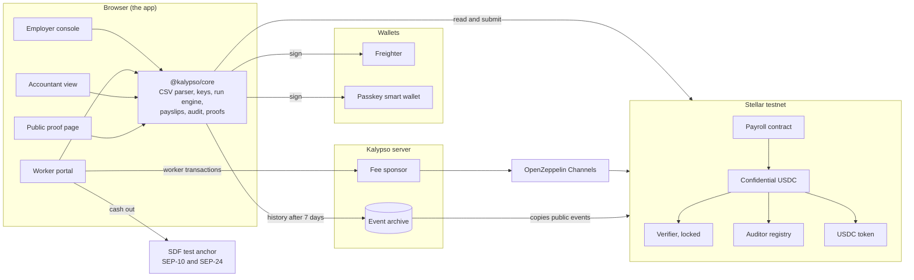
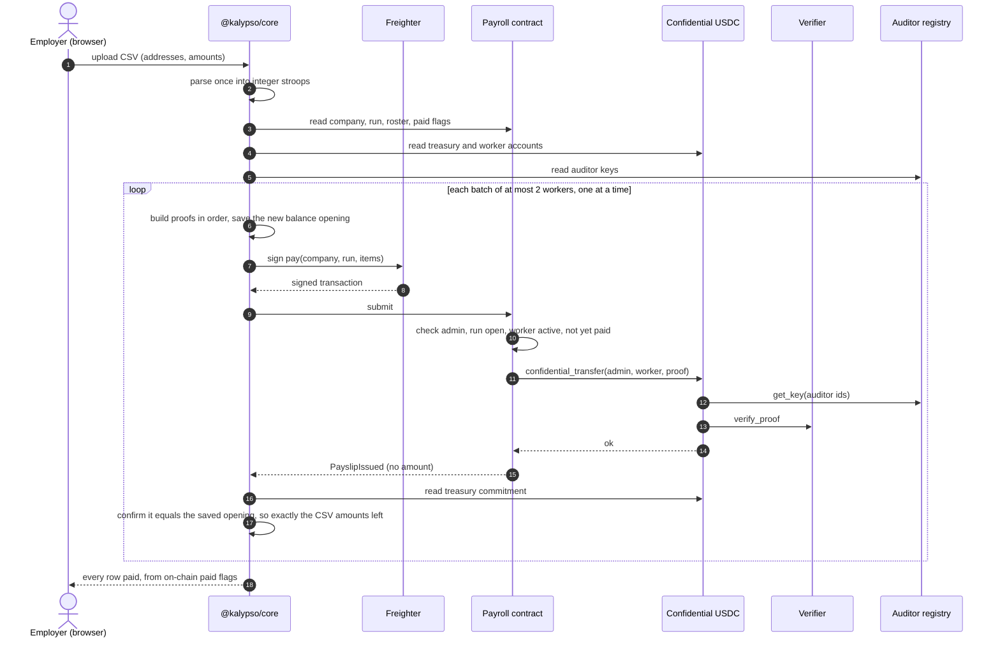
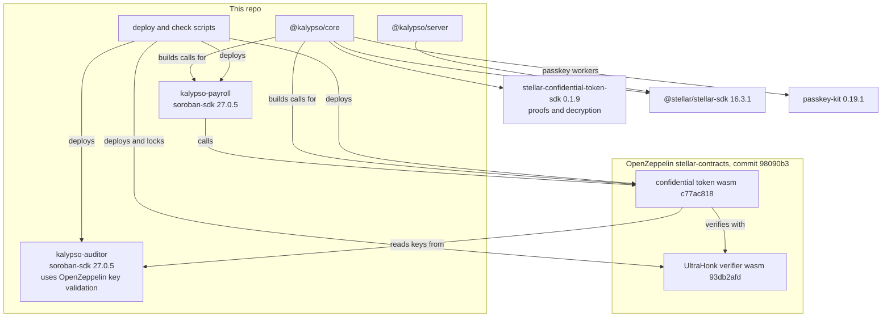

# Architecture

Kalypso pays a team in confidential USDC on Stellar. Amounts are hidden on the public ledger; each worker reads their own pay; the company's accountant reads everything the company paid. This page shows how the pieces fit, one payroll run end to end, and what depends on what.

Testnet stack (from `packages/contracts/deployments/testnet.json`; the final stack is redeployed from an attested GitHub release and this table is updated then):

| Contract | Code | Role |
|---|---|---|
| Payroll | `kalypso-payroll` (this repo) | Companies, invites, runs, pay at most once per worker per run |
| Auditor registry | `kalypso-auditor` (this repo) | Each accountant registers and controls their own auditor key |
| Confidential USDC | OpenZeppelin confidential token, wasm `c77ac818...` | Encrypted balances and transfers over testnet USDC |
| Verifier | OpenZeppelin UltraHonk verifier, wasm `93db2afd...` | Checks every proof; admin and manager renounced, keys can never change |
| USDC | Circle's testnet USDC token contract `CBIELTK6...DAMA` | The money underneath |

## 1. System overview

Amounts exist in plain form only in the employer's browser (the CSV they upload), the worker's browser (their own payslips) and the accountant's browser (with their key). The server sees transaction bytes, where amounts are ciphertexts, and public events.

## 2. One payroll run, end to end

A run that crashes halfway resumes from the on-chain paid flags; nobody is paid twice, and a worker paid in one run cannot be paid again in it.

## 3. What depends on what

## Interface the app uses

Payroll contract (`packages/contracts/payroll/src/contract.rs` holds the exact signatures, errors and doc comments):

| Call | Who signs | What it does |
|---|---|---|
| `create_company(admin, auditor_id, label)` | admin | New company; admin must already be registered with the token under `auditor_id` |
| `propose_admin` / `cancel_admin_proposal` / `accept_admin` | current admin, then the incoming admin | Two-step handover; the incoming admin must be registered under the company's auditor id |
| `invite_worker(company_id, worker)` / `revoke_invite` | admin | Invite, or withdraw an unaccepted invite |
| `accept_invite(company_id, worker)` | worker | Joins the roster; the worker must already be registered with the token |
| `remove_worker(company_id, worker)` | admin | Leaves pay history in place |
| `open_run(company_id, run_id, period_label, expected_count)` | admin | A run id opens once per company, ever |
| `pay(company_id, run_id, items)` | admin | 1 or 2 `(worker, proof data)` items; each worker at most once per run |
| `close_run(company_id, run_id)` | admin | No more pay in this run |
| `get_company`, `get_run`, `is_paid`, `worker_status`, `get_roster`, `pending_admin`, `token`, `company_count` | none | Reads |

Events carry no amounts: `CompanyCreated`, `AdminProposed`, `AdminProposalCancelled`, `AdminChanged`, `WorkerInvited`, `InviteRevoked`, `WorkerJoined`, `WorkerRemoved`, `RunOpened`, `PayslipIssued`, `RunClosed`. The first topic after the name is always `company_id`.

Auditor registry: `register_key(owner, point) -> u32`, `rotate_key(auditor_id, new_point)`, `propose_owner`, `cancel_owner_proposal`, `accept_owner`, `get_key(auditor_id)`, `owner_of`, `pending_owner`, `key_count`. No admin.

Confidential USDC (OpenZeppelin): `register(account, auditor_id, data)`, `deposit(from, to, amount)`, `merge(account)`, `confidential_transfer(from, to, data)`, `withdraw(from, to, amount, data)`, `confidential_balance(account)`. Deposit and withdraw amounts are public; transfer amounts and balances are not.

Server: `POST /api/sponsor` and `GET /api/sponsor/status` (fees for workers' own transactions, never an open relay), and the archive's `/v1/...` endpoints, compatible with the confidential SDK's indexer clients.

Costs on testnet, measured: pay 2 workers 0.49 XLM, pay 1 worker 0.24 XLM, create company 0.56 XLM, invite 0.28 XLM, accept 0.30 XLM, open run 0.38 XLM, token register 0.051 XLM. Most of the one-off figures are storage rent prepaid for about 180 days.
