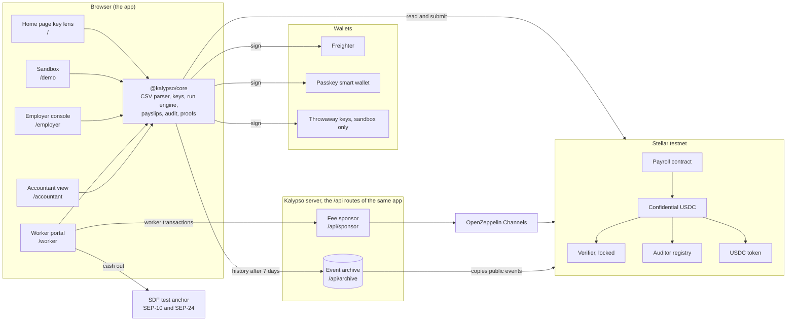
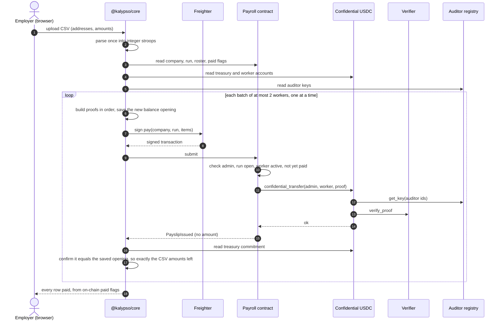
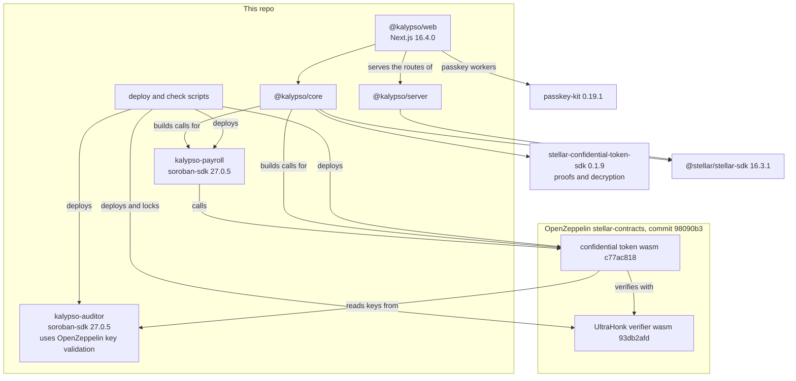

# Kalypso

Payroll on Stellar where nobody can read the salaries except the people who should.

The name is the Greek Kalypso (Καλυψώ), "she who conceals": the ledger shows every payment, and the amount stays sealed.

[Live app](https://kalypso-payroll.vercel.app) · [Docs](https://kalypso-payroll.vercel.app/docs) · [Sandbox](https://kalypso-payroll.vercel.app/demo) · Video: link added at submission

*The site deploys to this address before submission; until then, run it locally ([Quick start](#quick-start)).*

Built for the Find Your Way hackathon. Testnet only. Not audited by a security firm. It is self-audited: a threat model written before the code, an attack test for every claim, and a three-pass review whose 20 findings are all fixed or named as limits ([Security](#security)).

## Live on Stellar testnet

| Contract | Version | Address |
|---|---|---|
| Payroll | v0.1.1, attested release | [`CBUIUWF6PLCQHTLYUCYIKB34DCFXJG722N2JWE44LVICRCEY34KK7XVZ`](https://stellar.expert/explorer/testnet/contract/CBUIUWF6PLCQHTLYUCYIKB34DCFXJG722N2JWE44LVICRCEY34KK7XVZ) |
| Auditor registry | v0.1.0, attested release | [`CBG6BCHMPMKQGXAVIU475Q7TGFROD6BGZ5BQFEFBXWTOGSGF542AUZYG`](https://stellar.expert/explorer/testnet/contract/CBG6BCHMPMKQGXAVIU475Q7TGFROD6BGZ5BQFEFBXWTOGSGF542AUZYG) |
| Confidential USDC (OpenZeppelin confidential token) | OpenZeppelin stellar-contracts `98090b3` | [`CASNAZGPARZ46BT7IWDDHNZKCHMUWQ35FY4YR4S6YLE45CAJQUPSTTBZ`](https://stellar.expert/explorer/testnet/contract/CASNAZGPARZ46BT7IWDDHNZKCHMUWQ35FY4YR4S6YLE45CAJQUPSTTBZ) |
| Verifier (OpenZeppelin UltraHonk verifier, locked) | OpenZeppelin stellar-contracts `98090b3` | [`CDPF25R2OEACPIOPWSUMZUQHOPW2OYSRTAOHUU27AGNF5CFLFALWDPYM`](https://stellar.expert/explorer/testnet/contract/CDPF25R2OEACPIOPWSUMZUQHOPW2OYSRTAOHUU27AGNF5CFLFALWDPYM) |

The token wraps Circle's testnet USDC contract, [`CBIELTK6YBZJU5UP2WWQEUCYKLPU6AUNZ2BQ4WWFEIE3USCIHMXQDAMA`](https://stellar.expert/explorer/testnet/contract/CBIELTK6YBZJU5UP2WWQEUCYKLPU6AUNZ2BQ4WWFEIE3USCIHMXQDAMA).

The earlier payroll v0.1.0, [`CAC3P6WOEHUH2ZXCJ44TO5Q6RH6ALELP4GWDXUVCFJZ2MTYMZJYNIPWA`](https://stellar.expert/explorer/testnet/contract/CAC3P6WOEHUH2ZXCJ44TO5Q6RH6ALELP4GWDXUVCFJZ2MTYMZJYNIPWA), is kept on chain and no longer used by the showcase. It predates the accountant check, the handover bound and the three counters.

Every address, code hash and deploy transaction is in [`packages/contracts/deployments/testnet.json`](packages/contracts/deployments/testnet.json). The showcase company, Andes Studio (demo), is in [`showcase-testnet.json`](packages/contracts/deployments/showcase-testnet.json): company 0, 6 workers, two runs and 12 sealed payments.

## Overview

A company that pays its team in USDC on a public chain publishes every salary. Anyone with a block explorer can read who was paid and how much.

Kalypso keeps the payment on chain and seals the amount. The ledger still shows that the treasury paid each worker, and when. Each worker reads only their own pay. The company's accountant holds a key that reads every amount the company paid, and that key cannot move money. Nobody else can read a salary, Kalypso's server included: it only ever sees encrypted amounts.

It is built on OpenZeppelin's confidential token for Stellar, which the Stellar Development Foundation lists for payroll. The token hides balances and transfer amounts behind zero-knowledge proofs. Kalypso adds what payroll needs on top: a payroll contract with companies, rosters and pay runs, an auditor key registry the accountant controls, a client library that proves every payment in the browser, a fee sponsor that pays workers' fees, and an event archive. The payroll contract moves money only through the token, so without it the pay call has nothing to keep private.

It is for any company that pays a remote team in USDC, and for the accountant who keeps its books.

On testnet, a stranger who searched all 72 showcase transactions for the 12 salaries, in 15 encodings each, found none. The published demo accountant key opened all 12 ([attack run](docs/security/attack-run.md)).

| | Kalypso | Plain USDC payroll on Stellar | Bank payroll |
|---|---|---|---|
| Who can see each salary | The employer, that worker, and the company's accountant. On chain it is a sealed number. | Anyone with a block explorer | The employer, the banks and any payroll provider in between |
| Settlement time | Each pay transaction is final in one ledger, about 5 seconds. The showcase's October run landed 3 pay transactions for 6 workers within 25 seconds. | One ledger, about 5 seconds | Set by the banks, often a business day or more |
| Who holds the keys | The employer holds the treasury key, each worker their own, the accountant theirs. Kalypso holds none. | The employer and each worker, for their own wallets | The banks hold the accounts |
| How an auditor checks the books | The accountant's own key opens every amount, matched against the chain's own counts of runs and payments, and exports a CSV only when the books are complete | Reads the public ledger, like everyone else | Statements and reports from the employer and the bank |

What stays public, by design: who pays whom and when, each company's roster and so its head count, and deposit and withdraw amounts. The deposit that funds a treasury reveals the payroll total, and a worker who withdraws exactly one payslip reveals it.

## Features, by person

### Employer: the employer console at `/employer`

- Connect Freighter on testnet. The wallet's account becomes the company's treasury and pays its own fees.
- Name the accountant by id and address. Kalypso reads the auditor registry and shows a 16-character confirmation code to compare with the accountant's screen.
- Create the company: the treasury registers with the confidential token, with a proof built in the browser, then the payroll contract creates the company.
- Fund the treasury with a USDC deposit. The sealed balance opens in the browser with the employer's key.
- Invite up to 50 workers in one paste, and send each one the invite link.
- Pay a month from a CSV of up to 500 lines. The browser proves each payment, the wallet signs one pay per two workers, and after each pay the console confirms that exactly the approved amounts left the treasury.
- A run that stops resumes from the on-chain paid flags, so nobody is paid twice. On another browser, **Rebuild from chain** restores the treasury balance from its history.

### Worker: the worker portal at `/worker`

- Join from the invite link with Face ID, a fingerprint or the device PIN (a passkey smart wallet), or with Freighter.
- Kalypso's fee sponsor pays the fees for joining and for moving pay, so a Face ID worker's wallet never needs XLM. The cash-out account pays its own small XLM fees, from friendbot on testnet.
- **Your balance** and each payslip open on the device with the worker's own key. "History incomplete" shows when part of the history cannot be checked against the chain yet, and every amount still shown has passed that check.
- Move pay to a cash-out account as plain USDC, then cash out at the SDF test anchor in a popup. The amount, destination and memo come from the anchor's own record and are shown before the worker approves.

### Accountant: the accountant view at `/accountant`

- Derive a key from two Freighter signatures over the same message. It never leaves the browser, and the same wallet always rebuilds it.
- Register it in the auditor registry for about 0.07 XLM, once, and get an id only this account can change.
- Give the employer the id, the address and the confirmation code.
- Open a company's books by id. Each row shows the run, the worker, the transaction and the amount. The chip reads "Verified complete" only when every run and payment the chain counts was found and checked.
- **Export CSV**, refused unless the books are complete. Cells a spreadsheet would run as a formula are made harmless.

### Anyone checking: no wallet needed

- The home page `/`: the "Try to read the salaries" key lens reads the live showcase with the accountant's key or a stranger's. Every row links to its transaction on stellar.expert.
- The sandbox `/demo`: a whole payroll on testnet in your browser, ten steps, real proofs, about 3 minutes on a laptop. Then open it with each of five keys.
- The docs `/docs`: a guide for each screen, how it works, contracts and addresses, the threat model and the attack run.
- Three terminal commands, in the next section, check the live contracts with no Kalypso key.

## Testnet deployment detail

Each command block starts from the repo root.

### Where the code came from

Both of our contracts were built by GitHub Actions from a release tag, and each wasm carries a build attestation. The payroll comes from tag `v0.1.1`. The auditor registry was deployed from `v0.1.0` and kept, because its wasm (`90127a7d...`) is byte-identical in both releases. With the [stellar CLI](https://github.com/stellar/stellar-cli) 28.1.0:

```bash
stellar contract info build --id CBUIUWF6PLCQHTLYUCYIKB34DCFXJG722N2JWE44LVICRCEY34KK7XVZ --network testnet
```

It answers one question: which GitHub Actions run, in which repository, at which tag and commit, built the exact code running at this address. The answer is `.github/workflows/release.yml` at tag `v0.1.1`, commit `03dea9094ce7225fbe15845d2e265561c67b562c`, built on a GitHub-hosted runner. It does not judge the source itself, which is public at that commit. The same command with the registry's id names tag `v0.1.1` too, because release v0.1.1 built the same bytes as v0.1.0.

### Nobody can change the rules

`check:testnet` reads chain state and runs 18 checks: nobody, including us, can change which proofs the verifier accepts; neither of our contracts has an admin or an upgrade path; the code on chain is the released code; and every contract has at least 14 days before it archives. It needs `kalypso_payroll.wasm` from release v0.1.1 and `kalypso_auditor.wasm` from release v0.1.0, each in its own folder. Both are on the [Releases page](https://github.com/ramakrishnanhulk20/Kalypso/releases), and these lines fetch them:

```bash
mkdir -p release/v0.1.1 release/v0.1.0
curl -fL -o release/v0.1.1/kalypso_payroll.wasm https://github.com/ramakrishnanhulk20/Kalypso/releases/download/v0.1.1/kalypso_payroll.wasm
curl -fL -o release/v0.1.0/kalypso_auditor.wasm https://github.com/ramakrishnanhulk20/Kalypso/releases/download/v0.1.0/kalypso_auditor.wasm
cd packages/contracts/scripts && npm ci
npm run check:testnet -- --wasm-dir ../../../release/v0.1.1 --auditor-wasm-dir ../../../release/v0.1.0
```

A passing run ends with `18 of 18 checks passed. RESULT: PASS`.

### Attack the showcase

`prove:testnet` attacks the showcase company's promises on testnet and prints what stopped each attack. It runs 13 checks and needs no keys. It signs nothing with any showcase key; only check P11 sends transactions, from throwaway friendbot accounts it makes and forgets.

```bash
cd packages/core && npm ci && npm run build
cd ../contracts/scripts && npm ci && npm run prove:testnet
```

The last full run, on 8 October 2026 at ledger 5089999 and commit `03dea90`, ended with:

```text
13 passed, 0 failed of 13 checks. RESULT: PASS
```

That run had the seed's private file. Without it, the amounts are checked with the published demo accountant key and the worker half of P10 is skipped, so your run ends with `12 passed, 0 failed, 1 skipped of 13 checks. RESULT: PASS`. The full output is in [`docs/security/attack-run.md`](docs/security/attack-run.md).

The history checks (P1, P2, P3, P9 and P10) read RPC, which keeps about the last 7 days. Once the showcase's first ledger, 5084191, falls outside that window, they fail and say why; they never pass on missing history. Add `-- --archive <url>` to read older ledgers from Kalypso's event archive; its URL goes here after the archive is deployed.

### Keep the stack alive

```bash
cd packages/contracts/scripts && npm ci && npm run keepalive:testnet
```

This extends the storage life of all four contracts and their code, 60 days by default (`-- --days <n>` to change it), so none archives while it is being judged. Anyone may pay for an extension and it changes nothing else. It pays from the stellar CLI identity named by `DEPLOYER` (default `kalypso-deployer`) in `packages/contracts/.stellar`, which must exist and hold testnet XLM.

## Architecture

The full write-up is in [`ARCHITECTURE.md`](ARCHITECTURE.md) and on the [How it works](https://kalypso-payroll.vercel.app/docs/how-it-works) page.

### The system

Amounts exist in plain form only in the employer's browser (the CSV they upload), each worker's browser (their own payslips) and the accountant's browser (with their key). The server sees transaction bytes, where amounts are ciphertexts, and public events.



### One payroll run, end to end

A run that crashes halfway resumes from the on-chain paid flags; nobody is paid twice, and a worker paid in one run cannot be paid again in it.



### What depends on what



## The two-minute judge path

1. Open the [live app](https://kalypso-payroll.vercel.app). The home page reads "Pay your team in USDC. Nobody else can read the salaries." Choose **Try to read the salaries**.
2. The key lens shows Andes Studio (demo), read live from Stellar testnet: 6 workers, two runs, 12 sealed payments. With **Accountant's key** selected, move the lens over the ledger. A mouse moves it; on a phone, drag the ring. The amounts open under the lens, in your browser, with the demo accountant key published on purpose.
3. Choose **A stranger's key** and move the lens again. The same payments stay sealed. Open any row's transaction on stellar.expert: the payment is there, with no amount.
4. Open the [sandbox](https://kalypso-payroll.vercel.app/demo). Under "This month's payroll", type three salaries and choose **Start the sandbox**. It works through ten steps, each a real testnet transaction, in about 3 minutes on a laptop.
5. When the page says "Your payroll is on chain.", choose each key in turn. **Worker 1**, **Worker 2** and **Worker 3** each see their own payslip, **Accountant** sees every payment with its amount, and **Stranger** sees every payment sealed.
6. Open the [docs](https://kalypso-payroll.vercel.app/docs): the overview, then the [security overview](https://kalypso-payroll.vercel.app/docs/security/overview), which maps each claim to the check that proves it.
7. In a terminal, from a clone of this repo, run the prove command:

```bash
cd packages/core && npm ci && npm run build
cd ../contracts/scripts && npm ci && npm run prove:testnet
```

The last full run ended with `13 passed, 0 failed of 13 checks. RESULT: PASS` ([`docs/security/attack-run.md`](docs/security/attack-run.md)). Without the seed's private file, yours ends with `12 passed, 0 failed, 1 skipped of 13 checks. RESULT: PASS`.

## Quick start

You need Git and Node.js 24 (the server needs 24; the testnet scripts need 22.9 or later). The contract tests need a Rust toolchain (CI uses Rust 1.99.0), and the build attestation check needs the stellar CLI 28.1.0.

### Run the app locally

```bash
git clone https://github.com/ramakrishnanhulk20/Kalypso.git
cd Kalypso
cd packages/core && npm ci && npm run build
cd ../server && npm ci
cd ../web && npm ci
npm run dev
```

Open http://localhost:3000. With no variables set, the home page, the sandbox, the employer console, the accountant view and the docs all work, reading Stellar testnet directly, and every `/api` route answers 503 `not_configured`.

The worker portal sends every contract call through the fee sponsor. To run the sponsor and the archive locally, copy the example file, still in `packages/web`:

```bash
cp .env.example .env.local
```

Then set these in `packages/web/.env.local` and restart `npm run dev`:

| Variable | Value |
|---|---|
| `NETWORK` | `testnet` |
| `KALYPSO_DEV_MEMORY_DB` | `1`. The sponsor and the archive run on an in-memory database that lasts until the dev server stops. Leave both `DATABASE_URL_*` blank. Ignored in a production build. |
| `CHANNELS_API_KEY` | A free OpenZeppelin Channels testnet key: open https://channels.openzeppelin.com/testnet/gen and copy the `apiKey` value. |
| `CRON_SECRET` and `LOG_SALT` | Two different values, each from `openssl rand -hex 32` |
| `TRUSTED_IP_HEADER` | `x-forwarded-for`, under `next dev` only. A caller can forge it there, so never use it in production. |

The four contract ids are already filled in from `deployments/testnet.json`. Screens served over plain http read RPC's 7-day window and do not read the archive. Every variable has a one-line note in [`packages/web/.env.example`](packages/web/.env.example).

### Run the tests

After the `npm ci` steps above, each line runs from the repo root (`packages/contracts/scripts` needs its own `npm ci` first):

```bash
(cd packages/contracts && cargo test -p kalypso-payroll --locked)
(cd packages/contracts && cargo test -p kalypso-auditor --locked)
(cd packages/core && npx vitest run)
(cd packages/server && npx vitest run)
(cd packages/server && npm run test:wire)
(cd packages/web && npm test)
(cd packages/contracts/scripts && npm test)
```

## Contract functions

The exact signatures, errors and doc comments are in [`payroll/src/contract.rs`](packages/contracts/payroll/src/contract.rs) and [`auditor/src/contract.rs`](packages/contracts/auditor/src/contract.rs). A failed call shows up as `Error(Contract, #n)`, and any failure undoes the whole call: no flag, no transfer, no event.

### Payroll (v0.1.1)

| Function | Who signs | What it does | Errors |
|---|---|---|---|
| `create_company(admin, accountant, auditor_id, label) -> u64` | `admin` (the accountant does not sign) | Makes a company whose treasury is the admin's account. The admin must already be registered with the token under `auditor_id`, and the auditor registry must say `accountant` owns that id. Emits `CompanyCreated`. | 4 `LabelInvalid`, 2 `NotRegisteredWithToken`, 24 `TokenUnavailable`, 3 `AuditorMismatch`, 23 `AuditorNotOwnedByAccountant`, 21 `CounterOverflow` |
| `propose_admin(company_id, new_admin, live_until_ledger)` | current admin | Offers the admin role, replacing any earlier offer. The offer must end after the current ledger and no later than the network's furthest storage ledger. Emits `AdminProposed`. | 1 `CompanyNotFound`, 19 `InvalidLiveUntil` |
| `cancel_admin_proposal(company_id)` | current admin | Withdraws the offer. Emits `AdminProposalCancelled`. | 1 `CompanyNotFound`, 17 `NoPendingAdmin` |
| `accept_admin(company_id)` | the proposed admin | Completes the handover. The new admin must not be invited or active here, and must be registered under the company's auditor id. Raises `admin_changes`. Emits `AdminChanged`. | 1, 17 `NoPendingAdmin`, 18 `AdminTransferExpired`, 5 `WorkerIsAdmin`, 2, 24, 3, 21 |
| `invite_worker(company_id, worker)` | admin | Invites a worker; a removed worker can be invited again. Emits `WorkerInvited`. | 1, 5 `WorkerIsAdmin`, 6 `AlreadyMember` |
| `revoke_invite(company_id, worker)` | admin | Withdraws an unaccepted invite. Emits `InviteRevoked`. | 1, 7 `InviteNotFound` |
| `accept_invite(company_id, worker)` | `worker` | Joins the roster. The worker must already be registered with the token, under their own auditor id. The first join raises `memberships_of(worker)`. Emits `WorkerJoined`. | 1, 5, 7 `InviteNotFound`, 2, 24, 21 |
| `remove_worker(company_id, worker)` | admin | The worker can no longer be paid; the roster entry and pay history stay. Emits `WorkerRemoved`. | 1, 8 `NotActive`, 21 |
| `open_run(company_id, run_id, period_label, expected_count)` | admin | Opens a pay run. A run id opens once per company, ever. Raises `runs_opened`. Emits `RunOpened`. | 1, 9 `RunExists`, 4 `LabelInvalid`, 16 `ExpectedCountInvalid`, 21 |
| `pay(company_id, run_id, items)` | admin, whose one signature covers each nested token transfer | Takes 1 or 2 `(worker, proof data)` items. For each, checks the worker is active and not yet paid in this run, sets the paid flag, then calls the token's `confidential_transfer` from the treasury to that worker. Emits `PayslipIssued`, with no amount, per item. | 1, 10 `RunNotFound`, 11 `RunNotOpen`, 12 `NoItems`, 13 `TooManyItems`, 5, 8 `NotActive`, 14 `AlreadyPaid`, 21, 15 `ExpectedCountExceeded`, or the token's own error |
| `close_run(company_id, run_id)` | admin | Ends the run; its id can never open again. Emits `RunClosed`. | 1, 10, 11 |
| `get_company`, `get_run`, `is_paid`, `worker_status`, `get_roster`, `memberships_of`, `pending_admin`, `token`, `auditor_registry`, `company_count` | none | Reads. `get_roster` returns pages of 1 to 50. | 1 and 10 for unknown ids, 20 `LimitInvalid`, 22 `MissingRecord` |

The constructor, `__constructor(token, auditor_registry)`, fixes both addresses for the contract's life. The contract has no admin of its own and no upgrade path. A batch holds at most 2 payments because each proof is about 15.4 KB and travels three times in the transaction: 2 payments measured 93,948 bytes and 3 measured 140,432, against the network's 132,096 byte cap.

### Auditor registry (v0.1.0)

| Function | Who signs | What it does | Errors |
|---|---|---|---|
| `register_key(owner, point) -> u32` | `owner` | Stores a key under the next id, in order from 0, and makes `owner` the only address that can change it. Emits OpenZeppelin's `AuditorRegistered`, then `OwnerSet`. | 105 `CounterOverflow`; OpenZeppelin's 3302 `IdentityPoint`, 3303 `PointNotOnCurve` |
| `rotate_key(auditor_id, new_point)` | the id's owner | Replaces the key. Only events after the rotation are encrypted to the new key. Emits OpenZeppelin's `AuditorRotated`. | 100 `UnknownAuditor`, 3302, 3303 |
| `propose_owner(auditor_id, new_owner, live_until_ledger)` | the id's owner | Offers the id to a new owner, replacing any earlier offer. Emits `OwnerProposed`. | 100, 104 `SameOwner`, 103 `InvalidLiveUntil` |
| `cancel_owner_proposal(auditor_id)` | the id's owner | Withdraws the offer. Emits `OwnerProposalCancelled`. | 100, 101 `NoPendingOwner` |
| `accept_owner(auditor_id)` | the proposed owner | Completes the handover by the offer's deadline. Emits `OwnerChanged`. | 100, 101, 102 `OwnerTransferExpired` |
| `get_key(auditor_id)` | none | Returns the key. The only call the token makes, and it extends the key's storage life. | OpenZeppelin's 3301 `AuditorNotRegistered` |
| `owner_of(auditor_id)`, `pending_owner(auditor_id)`, `key_count()` | none | Reads | 100 for an unknown id |

The registry has no constructor, no admin and no upgrade entry point, so the deployer has the same powers as any stranger.

## Test results

Run on 9 October 2026. Every suite passed: 1,432 tests in all. The server's tests run twice, once on the in-process test database and once through the production Postgres driver, and the total counts them once.

| Suite | Command, from the repo root | Tests |
|---|---|---|
| Payroll contract | `cd packages/contracts && cargo test -p kalypso-payroll --locked` | 115: 104 unit, 10 attack, 1 property test |
| Auditor registry | `cd packages/contracts && cargo test -p kalypso-auditor --locked` | 43: 37 unit, 2 attack, 1 property, 3 against OpenZeppelin's token wasm |
| Core library | `cd packages/core && npx vitest run` | 555 in 27 files |
| Server | `cd packages/server && npx vitest run` | 316 in 14 files |
| Server, production driver | `cd packages/server && npm run test:wire` | the same 316 |
| Web app | `cd packages/web && npm test` | 392 in 40 files |
| Testnet scripts | `cd packages/contracts/scripts && npm test` | 11 |

Line coverage: core 98.46%, server 97.99%.

Payroll, one line per test binary (unit tests, `tests/attacks.rs`, `tests/props.rs`):

```text
test result: ok. 104 passed; 0 failed; 0 ignored; 0 measured; 0 filtered out; finished in 0.04s
test result: ok. 10 passed; 0 failed; 0 ignored; 0 measured; 0 filtered out; finished in 0.03s
test result: ok. 1 passed; 0 failed; 0 ignored; 0 measured; 0 filtered out; finished in 8.45s
```

Auditor registry (unit tests, `tests/attacks.rs`, `tests/props.rs`, `tests/token_integration.rs`):

```text
test result: ok. 37 passed; 0 failed; 0 ignored; 0 measured; 0 filtered out; finished in 0.17s
test result: ok. 2 passed; 0 failed; 0 ignored; 0 measured; 0 filtered out; finished in 0.26s
test result: ok. 1 passed; 0 failed; 0 ignored; 0 measured; 0 filtered out; finished in 6.89s
test result: ok. 3 passed; 0 failed; 0 ignored; 0 measured; 0 filtered out; finished in 0.02s
```

Core library:

```text
 Test Files  27 passed (27)
      Tests  555 passed (555)
   Start at  19:57:31
   Duration  9.36s (tests 68%, import 25%, transform 7%)
```

Server:

```text
 Test Files  14 passed (14)
      Tests  316 passed (316)
   Start at  19:57:41
   Duration  7.63s (tests 89%, import 8%, transform 3%)
```

Server, through the production Postgres driver (`npm run test:wire`):

```text
 Test Files  14 passed (14)
      Tests  316 passed (316)
   Start at  19:57:58
   Duration  7.28s (tests 88%, import 9%, transform 3%)
```

Web app:

```text
 Test Files  40 passed (40)
      Tests  392 passed (392)
   Start at  19:57:50
   Duration  3.98s (import 55%, transform 23%, tests 21%)
```

Testnet scripts:

```text
ℹ tests 11
ℹ suites 0
ℹ pass 11
ℹ fail 0
ℹ cancelled 0
ℹ skipped 0
ℹ todo 0
```

## Costs

Measured on testnet, the median per transaction from the v0.1.1 seed, network fee included:

| Action | Who pays | Cost |
|---|---|---|
| Pay 2 workers (one `pay` transaction) | Employer | 0.51 XLM |
| Open a run | Employer | 0.40 XLM |
| Create a company | Employer | 0.68 XLM |
| Invite a worker | Employer | 0.30 XLM |
| Accept an invite | The fee sponsor, for the worker | 0.42 XLM |
| Register with the token | The account registering; the fee sponsor for workers | 0.051 XLM |
| Register an auditor key, on a registry that already holds keys | The accountant; the fee sponsor for workers | 0.071 XLM |

In plain words: a 10-person run is one open and five pays, about 2.95 XLM. Closing the run is one more transaction, which the seed did not measure. Setup is one-off, and most of the one-off figures are storage rent prepaid for about 180 days. The first key on a fresh registry cost about 13 XLM.

The fee sponsor pays the worker's side of joining. Creating a Face ID wallet measured 1.79 XLM, so the sponsor caps any one transaction at 2.5 XLM on testnet and spends at most 200 XLM a day, with limits per IP per hour, per authorising address per day, and at most three wallet creations per IP per day.

Keeping the stack alive is paid separately, in testnet XLM: extending the payroll and the auditor registry to 180 days cost 147.78 and 88.52 XLM, and extending the token and the verifier to 60 days cost 227.55 XLM together.

## Project structure

| Path | What it holds |
|---|---|
| `packages/contracts/payroll` | The Soroban payroll contract: companies, invites, runs, pay at most once per worker per run |
| `packages/contracts/auditor` | The auditor key registry: each accountant registers and controls their own key |
| `packages/contracts/fixtures` | OpenZeppelin's confidential token, verifier and example auditor builds, fetched from testnet by hash, that our tests run against |
| `packages/contracts/scripts` | Deploy, seed, check, prove and keepalive scripts for testnet |
| `packages/contracts/deployments` | `testnet.json` and `showcase-testnet.json`: every address, hash and transaction |
| `packages/core` | `@kalypso/core`: CSV import, USDC amounts, address parsing, key derivation, proving, the run engine, payslips, the audit and history checks |
| `packages/server` | `@kalypso/server`: the fee sponsor and the event archive, as Web Fetch handlers |
| `packages/web` | `@kalypso/web`: the Next.js app with the home page, the sandbox, the three screens, `/docs` and the `/api` routes |
| `docs/security` | The threat model, the attack run and the static analysis record |
| `.github/workflows` | `ci.yml` (tests, clippy, coverage, Scout, npm audit), `release.yml` (attested contract builds from a tag), `archive.yml` (the hourly archive ingest and its health check) |

## Tech stack

| Layer | Package | Version |
|---|---|---|
| Contracts | Rust toolchain (CI) | 1.99.0 |
| | soroban-sdk | 27.0.5 |
| | OpenZeppelin stellar-tokens, the confidential token revision of 31 July 2026 | commit `98090b3` |
| | proptest | 1.11.0 |
| | stellar CLI | 28.1.0 |
| Client library | @stellar/stellar-sdk | 16.3.1 |
| | stellar-confidential-token-sdk (proofs and decryption) | 0.1.9 |
| | @noble/hashes | 1.8.0 |
| Server | postgres | 3.4.9 |
| | zod | 4.6.5 |
| | @electric-sql/pglite (tests and the local in-memory database) | 0.5.8 |
| App | Next.js | 16.4.0 |
| | React | 19.3.0 |
| | Tailwind CSS | 4.3.3 |
| | fumadocs-core and fumadocs-ui / fumadocs-mdx | 16.16.2 / 15.4.6 |
| | Mermaid | 12.1.0 |
| | GSAP | 3.15.0 |
| | Lenis | 1.3.26 |
| | Motion | 14.0.0 |
| | passkey-kit | 0.19.1 |
| | @stellar/freighter-api | 6.0.1 |
| | Geist | 1.7.2 |
| Tooling | Node.js | 24 |
| | TypeScript | 7.0.2 |
| | Vitest | 5.0.3 |
| Services | OpenZeppelin Channels (relays sponsored transactions), the SDF test anchor (SEP-10 and SEP-24), Stellar testnet RPC, Vercel (hosting) | |

## Security

The [threat model](docs/security/threat-model.md) was written on 7 October 2026, at the architecture gate, before any contract code. It names the attackers: an anonymous internet user, a malicious company admin, a malicious worker, a lying upstream service or package, and an insider holding our deploy keys. It sets out the trust boundaries, every input an attacker controls, what each attacker wants, and 55 invariants the code must uphold. Its section C is the definition of done: a piece of the system is finished only when every invariant that applies to it is upheld and a test shows it.

A three-pass review attacked the code at commit `fb9f2b5` and the threat model itself: the contracts, the client money path, and the payslips, sponsor and archive. It found 20 issues: 1 High, 3 Medium, 8 Low and 8 Info. Every one was fixed or named as a limit in the threat model, and its attack tests stay in the suites as refusing tests. Its fixes added invariants C38 to C50, and the contract fixes shipped as payroll v0.1.1.

Two more review passes sit on either side of it. The backend gate review on 8 October attacked section C against the code as built, and its findings became invariants C29 to C37. A second pass re-checked every fix from the three-pass review. The app's screens, and the sponsor's rule for paying to create a passkey wallet, were built after those two. A finishing review on 9 October then attacked the built screens, the server and the standard itself, and walked a production build end to end; its findings became invariants C51 to C55 ([audits](https://kalypso-payroll.vercel.app/docs/security/audits)). None of these reviews was done by a security firm.

Both contracts are built by GitHub Actions from a release tag, and each wasm carries a build attestation. The workflow that writes attestations pins every third-party action by commit, not by tag. `check:testnet` then confirms from chain state that the released code is what runs. The static analysis record is [`docs/security/static-analysis.md`](docs/security/static-analysis.md). Scout reported 33 findings. 9 were fixed, each with a test that forces the failure, and 24 were justified, each with a reason checked against the code at that line. Its rescan at v0.1.1 found no new kind. cargo audit reports 0 vulnerabilities and 1 warning, an unmaintained macro crate that never ships in a contract. clippy runs with `-D warnings`.

What Kalypso does not defend, in plain words:

- Only amounts are private. Who pays whom, when, the roster and the head count are public, and so are deposit and withdraw amounts.
- The company's accountant sees every amount the company pays and the treasury's balance after each payment. That is what the key is for.
- A leaked key opens everything ever encrypted to it. Rotating the key protects only later payments.
- The contract cannot know whether a hidden amount is the right salary. Kalypso catches a wrong amount after each payment; it does not prevent one.
- A compromised wallet extension or computer, a user who signs Kalypso's key message on a phishing site, the USDC issuer freezing the pooled funds, and the anchor's view of cash-out amounts.
- Flaws in OpenZeppelin's confidential token, its circuits or its verifier, which are new and unaudited.
- Real money. Kalypso runs on testnet only.

Read more: [threat model](docs/security/threat-model.md), [attack run](docs/security/attack-run.md), [static analysis](docs/security/static-analysis.md), and on the site the [security overview](https://kalypso-payroll.vercel.app/docs/security/overview), [threat model](https://kalypso-payroll.vercel.app/docs/security/threat-model), [attack run](https://kalypso-payroll.vercel.app/docs/security/attack-run) and [audits](https://kalypso-payroll.vercel.app/docs/security/audits) pages.

## License and acknowledgments

MIT, in [`LICENSE`](LICENSE). The files in `packages/contracts/fixtures` are OpenZeppelin builds under Apache-2.0.

Kalypso stands on other people's work:

- OpenZeppelin's [confidential token for Stellar](https://github.com/OpenZeppelin/stellar-contracts), its circuits and its UltraHonk verifier, which do the cryptography.
- The Stellar Development Foundation, for the network, its testnet and friendbot.
- [passkey-kit](https://github.com/stellar/passkey-kit), for the workers' Face ID wallets.
- OpenZeppelin Channels, which relays the fee sponsor's transactions.
- The SDF [test anchor](https://testanchor.stellar.org), where workers cash out on testnet.
- [stellar-confidential-token-sdk](https://github.com/aguilar1x/stellar-confidential-token-sdk), which builds the proofs and decrypts the amounts.
