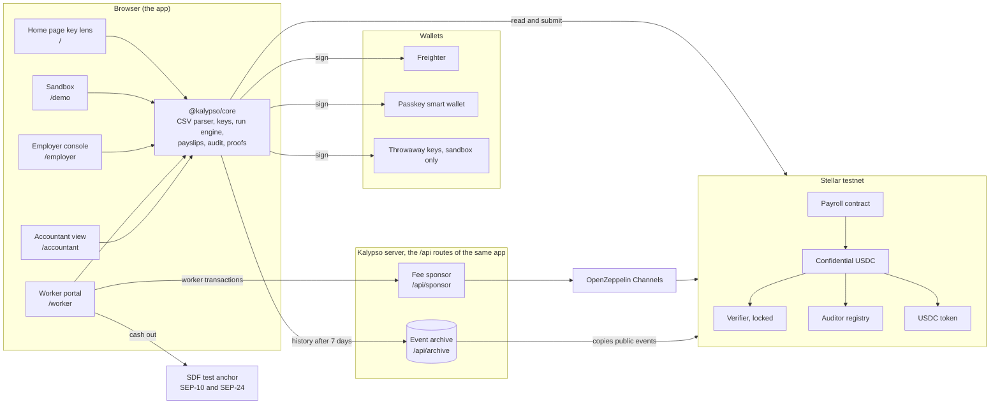
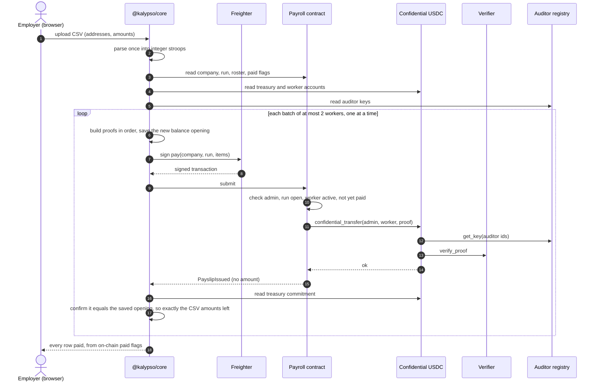
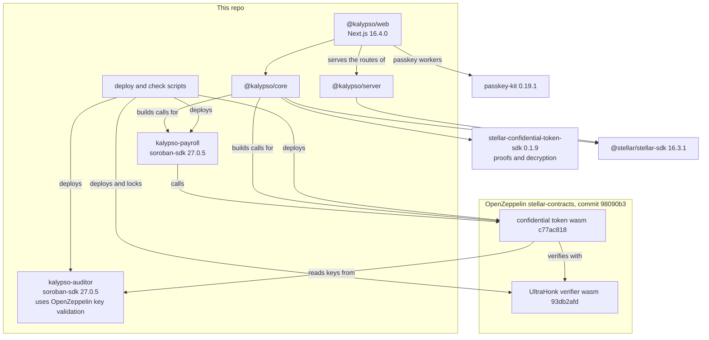

Kalypso has four parts: OpenZeppelin's confidential token on Stellar, two contracts of our own (payroll and an auditor key registry), a client library that the web app runs in the browser, and a server with a fee sponsor and an event archive, served by the same app.

## The whole system

Amounts exist in plain form only in the employer's browser (the CSV they upload), the worker's browser (their own payslips) and the accountant's browser (with their key). The server sees transaction bytes, where amounts are ciphertexts, and public events.

Each box in the browser is a page of the app. The home page's key lens (`/`) reads the showcase company with a key you pick, and the sandbox (`/demo`) runs a whole payroll with throwaway keys. The employer console (`/employer`) and the accountant view (`/accountant`) sign with Freighter. The worker portal (`/worker`) signs with a passkey smart wallet or with Freighter, sends the worker's contract calls through the fee sponsor, and cashes out at the SDF test anchor. The [guides](/docs/guides/employer) walk each screen.

## The confidential token

Kalypso does not invent its own cryptography. The money moves through OpenZeppelin's confidential token for Stellar (the 31 July 2026 revision, commit 98090b3 of OpenZeppelin/stellar-contracts), deployed as Kalypso's own instance over Circle's testnet USDC.

- You deposit USDC into the token and get a confidential balance. Deposit amounts are public.
- Balances and transfer amounts are stored as Pedersen commitments: sealed numbers the contract can add up and check but cannot read. The holder keeps the opening, the value and the random blinding behind each commitment, off chain.
- Every spend carries a zero-knowledge proof built by the sender. It shows the payment is valid and the sender can afford it, without showing the number. A separate verifier contract checks every proof.
- Each account registers under one auditor id, once, with no way to change it later. Every transfer is readable by two auditor keys: the sender's, which sees the amount and the sender's new balance, and the recipient's, which sees the amount.
- Incoming money lands in a separate receiving balance and is merged before it is spent, so nobody can break a spend proof by sending you money.
- Sender and recipient addresses are public. Withdraw amounts are public.

## What the payroll contract adds

The token can move confidential money, but it knows nothing about companies, rosters or pay periods. The [payroll contract](https://github.com/ramakrishnanhulk20/Kalypso/blob/main/packages/contracts/payroll/src/contract.rs) adds them, and it moves money only by calling the token's `confidential_transfer` out of the company's treasury.

- Companies. `create_company(admin, accountant, auditor_id, label)` makes a company whose treasury is the admin's account. The admin must already be registered with the token under `auditor_id`, and the auditor registry must say `accountant` owns that id, or the call fails with error 23.
- Invites. The admin invites a worker and the worker accepts with their own signature. A worker must already be registered with the token to accept. The admin can withdraw an unaccepted invite or remove a worker, and pay history stays.
- Runs. `open_run` opens a pay period with an expected head count. A run id opens once per company, ever, and `close_run` ends it.
- Pay at most once. `pay(company_id, run_id, items)` takes one or two workers, each with a proof. It checks the admin's signature, that the run is open, and that every worker is on the roster and not yet paid in this run. Then it calls the token's transfer for each worker and marks each one paid. A worker listed twice reverts the whole call. The payslip event carries no amount. The cap of two was set from measured transaction sizes.
- Counters. Each company counts the runs it opened and its admin changes, and `memberships_of(worker)` counts the companies a worker ever joined. A history reader that is served fewer runs or companies than the chain counts knows something was hidden.
- Handover. The admin role moves in two steps. The offer expires within the network's longest storage lifetime, and the incoming admin must be registered under the company's auditor id.

Rosters, runs and paid flags live in persistent storage, and every write extends them to 180 days. The contract has no admin of its own and no upgrade path. Its token and registry are set by the constructor and fixed for the contract's whole life.

## The auditor registry

OpenZeppelin's example auditor contract lets one manager set the key under every auditor id. Whoever held that role could swap an accountant's key for their own and read every future salary. Kalypso's [auditor registry](https://github.com/ramakrishnanhulk20/Kalypso/blob/main/packages/contracts/auditor/src/contract.rs) has no manager and no admin.

- `register_key(owner, point)` stores a key and returns the next id. The owner, normally the accountant, signs.
- Only the owner can `rotate_key`. Ownership moves in two steps, with an offer that expires.
- Keys go through OpenZeppelin's key validation, which refuses the identity point and points off the curve.

Ids are handed out in order, so anyone can read the next id and register their own key under it first. A treasury that registered under a predicted id would then encrypt every salary to the attacker. Kalypso never predicts an id. The treasury registers under the id that the accountant's confirmed registration returned. Before the treasury signs, the client reads that id's owner and key from chain and refuses unless they are the accountant's. And the payroll contract refuses to create a company unless the registry says the named accountant owns the id. Attack P11 in the [attack run](/docs/security/attack-run) tries this front-run against testnet on every run.

Workers register their own audit key too, so the recipient's copy of each payment opens only for that worker.

## What happens in the browser

The client library, `@kalypso/core`, does every step that needs a secret, so secrets stay on the device.

### Keys

A Freighter user's key comes from the wallet signing a message that names Kalypso, its domain, the network, the token and the account, and says to sign it only on Kalypso's domain. Derivation takes two signatures over that message and refuses unless they are byte for byte equal, so a key is proven reproducible before anything is registered under it. Passkey users derive the key from the passkey's PRF output instead, and a passkey that returns no PRF output is refused, never weakened. The same PRF output also makes the key of the worker's cash-out account. Both paths are pinned by test vectors. The worker portal offers both, and the employer console and accountant view use Freighter. The passkey path has run end to end in Chrome with a virtual authenticator that supports PRF. Support for PRF differs between phones, laptops and passkey providers, and Kalypso has not been checked on every one.

### Proving

Every proof is built in the browser with the token's published circuits, using a fresh salt from `crypto.getRandomValues`. A retry after a revert builds a new proof with a new salt.

### The run engine

One payroll run, end to end:

- The spreadsheet is parsed once into integer stroops, USDC's smallest unit (7 decimal places). What the employer approves, the proof input and the check after payment all use that one parsed value.
- Before any transaction, a preflight checks the company, the run, every worker's roster entry and token registration, that nobody is bound to the published demo auditor key, and that the treasury's verified balance covers the run.
- Each pay transaction carries up to two payments, and one pay per treasury is in flight at a time. Each batch is proved only against chain state after the previous one is final.
- After each pay lands, the engine reads the treasury's new commitment and confirms it opens with the balance saved before sending, so exactly the approved amounts left. Any mismatch stops the run.
- Paid, pending and failed labels come from the contract's paid flags, never from a relayer's reply. A batch that cannot be built, for example after a worker rotated their key, marks only its own rows failed and the run goes on. A refusal from the network stops the run.

### Never forgetting a landed pay

Before a pay is sent, the device saves the new balance opening the pay will leave behind. That record is removed only after an opening that opens the chain is adopted, or after the transaction failed or expired by the chain's own clock. No RPC answer deletes a saved opening. A balance read one ledger behind, a lying close time or a second tab therefore ends with the run resuming, never with a locked treasury. A run that crashes halfway resumes from the on-chain paid flags, and nobody is paid twice.

### The rebuild

On a new laptop, after cleared storage, or when the device's records disagree with the chain, the employer can rebuild the treasury's opening from its token history. The result must open the on-chain balance or nothing is written. What the device expected is reported beside what the chain holds, because a difference means the treasury moved in a way this device did not record. The rebuild is always an explicit step, never automatic.

### Reading pay

A payslip is shown only when a payroll event from Kalypso's contract, a token transfer from the company's treasury to that worker in the same transaction, and the on-chain paid flag all agree, and the decrypted amount is in range. A direct transfer or a deposit from anyone else never becomes a payslip, and the accountant's totals count exactly the same set. Every balance rebuilt from history is checked against the on-chain commitment before it is shown or used, and a mismatch shows "history incomplete", never a number.

## The fee sponsor and the archive

The fee sponsor (`POST /api/sponsor`) pays the network fee for a worker's own transactions and relays them through OpenZeppelin Channels. For a passkey worker it carries the whole join: creating the passkey wallet, registering the worker's own audit key, registering with the token and accepting the invite. It also pays for the merge and the withdraw that move pay to the cash-out account. A Freighter worker signs their own transaction, and the sponsor wraps it in a fee bump. The employer console and the accountant view do not use it: those wallets pay their own fees.

It is not an open relay. It decodes the exact bytes it will forward and pays only for one host function whose root is one of three things: a call into Kalypso's payroll or token, `register_key` on Kalypso's auditor registry signed by the key's owner alone, or one passkey wallet creation. That creation must come from passkey-kit's shared deployer, run the pinned wallet code, and set exactly one passkey signer with no expiry and no limits, and it may touch only its own new wallet's entries. Every contract the call can run must be Kalypso's, USDC's, the verifier, or a wallet running the pinned code, and the fee must be under 2.5 XLM on testnet. Limits apply per IP per hour, per authorising address per day, to at most three wallet creations per IP per day, and to a daily budget of 200 XLM on testnet. A relay the relayer provably refused returns its budget, and one signed approval is relayed at most once. The sponsor never pays for plain Stellar operations, so a cash-out account pays its own small XLM fees for its USDC trustline and the anchor payment.

Stellar RPC keeps about the last 7 days of events, and a confidential balance cannot be read or spent without its history. The event archive copies the public events of Kalypso's contracts verbatim, on a schedule that does not depend on visitors, and deduplicates them by event id. It tracks which ledgers it holds without gaps. Every reply says whether it is complete and how far it has ingested, and its health check answers 503 on a gap or a stale ingest. It vouches for history from the deploy only when the first token events it read come from the token's own deploy transaction; otherwise its health says which ledger it vouches from. Its API lives at `/api/archive/v1/...` on the app's own server and is compatible with the confidential SDK's indexer clients.

Every screen reads the archive from its own site at `/api/archive`, and only over https. When the archive does not answer, or the page runs on a plain http dev server, readers use RPC's window alone, so history older than about 7 days shows as incomplete instead of as a number.

Nothing trusts the archive alone. A balance rebuilt from it must open the on-chain commitment, and a payslip list must match the chain's own counters. Its public URL goes in the README after it is deployed.

## What depends on what

The two contracts pin soroban-sdk 27.0.5 to match the deployed OpenZeppelin token. Every address, code hash and call is on [Contracts and addresses](/docs/contracts).
